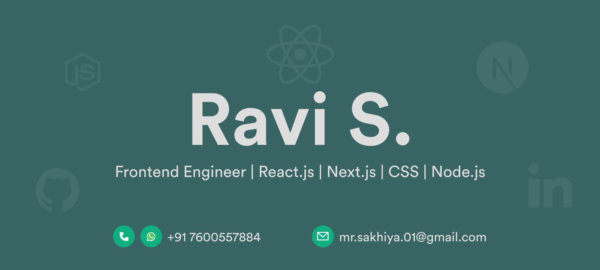

<h1 align="center">👋🏻 Hi, I'm Ravi Sakhiya</h1>

 

 
 

 

[;React+%7C+Next.js+%7C+Tailwind+%7C+Node.js;Fullstack+MERN+Engineer;Building+from+UI%2FUX+to+API+%26+DevOps)](https://git.io/typing-svg)

## 🚀 About Me

- 🌟 Frontend Developer with **6+ years of experience** crafting modern, scalable, responsive UIs.
- ⚛️ Specialized in **React.js, Next.js, Tailwind CSS**, integrating robust backends with Node & Express.
- ✨ Passionate about clean design, pixel-perfect layouts, and seamless UX.
- 💼 Comfortable leading projects end-to-end — from Figma concepts to production CI/CD.
- 📊 Built ERP, CRM, eCommerce, SaaS dashboards for global clients in healthcare, betting, and IT.
- 📚 Always learning new frameworks and optimizing workflows for speed & quality.
- 💬 Keep me in your touch : mr.sakhiya.01@gmail.com

 

## 🔥 My Tech Stack

**Frontend:**

**Backend & APIs:**

**Tools & Workflow:**

 

## ✨ Featured Projects

- 🔗 **[eGroupGreeting](https://egroupgreeting.com/)**  
  → A platform for creating digital group greeting cards.  
  Tech: React.js, Laravel API. Delivered responsive UI, production-ready for **10K+ monthly users**.

- 🔗 **[AaldaVet360](https://aaldavet360.com/jp/)**  
  → Veterinary product eCommerce with multi-language SEO-optimized Next.js site + Opencart backend.

- 🔗 **[Gambet.io](https://gambet.io) / [Game Dashboard](https://game.gambet.io/)**  
  → Sports betting analytics platform with React.js, Node.js, Bootstrap.

- 🔗 **[ZucheStore](https://zuchestore.com/)**  
  → Pharmacy eCommerce: Next.js frontend, Node API, React admin panel with Tailwind.

- 🔗 **[Prism Infoways](https://prisminfoways.com/)**  
  → Multi-service IT company site in React + Next.js with responsive, high-speed optimized UI.

- 🛠 **Marketplace Contributions**  
  - 🎨 [Snail Template on ThemeForest](https://themeforest.net/item/snail-creative-multipurpose-html5-templates/28062252)  
  - 🗂️ [VipsPM on CodeCanyon](https://codecanyon.net/item/vipspm-angular8-laravel57-project-suite/25335792)

 

## 📈 GitHub Stats

  
    
    &nbsp;
    

 

## 🌐 Connect with Me

    
    &nbsp;
    
    &nbsp;
    
    &nbsp;
    

---

> 📝 *Currently open for remote/hybrid frontend engineering roles. Feel free to reach out for collaboration or freelance projects.*

